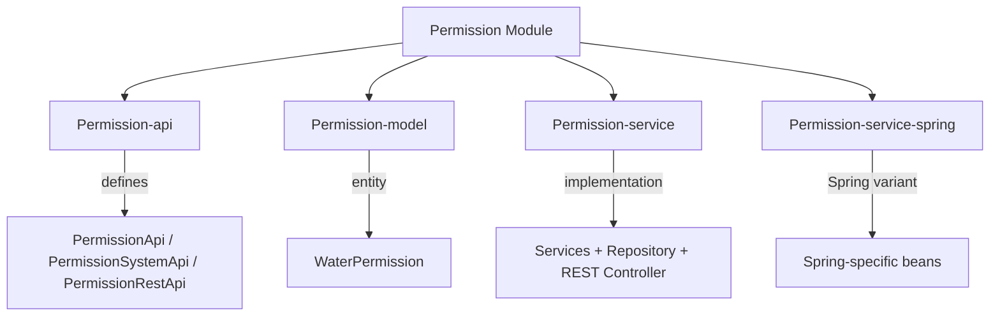

# Permission Module

The **Permission** module provides the permission management system for the Water Framework. It enables defining, assigning, and verifying permissions on entities, resources, and actions — at both role and user level — ensuring granular and centralized control over application security policies.

## Architecture Overview



## Sub-modules

| Sub-module | Description |
|---|---|
| **Permission-api** | Defines `PermissionApi`, `PermissionSystemApi`, `PermissionRestApi`, and `PermissionRepository` interfaces |
| **Permission-model** | Contains the `WaterPermission` JPA entity |
| **Permission-service** | Service implementations, repository, and REST controller |
| **Permission-service-spring** | Spring-specific service registration |

## WaterPermission Entity

```java
@Entity
@Table(uniqueConstraints =
    @UniqueConstraint(columnNames = {"roleId", "userId", "entityResourceName", "resourceId"}))
@AccessControl(availableActions = { CrudActions.class },
    rolesPermissions = {
        @DefaultRoleAccess(roleName = "permissionManager", actions = { "save","update","find","find_all","remove" }),
        @DefaultRoleAccess(roleName = "permissionViewer", actions = { "find","find_all" }),
        @DefaultRoleAccess(roleName = "permissionEditor", actions = { "save","update","find","find_all" })
    })
public class WaterPermission extends AbstractJpaEntity implements ProtectedEntity { }
```

### Entity Fields

| Field | Type | Constraints | Description |
|---|---|---|---|
| `name` | String | `@NotNull` | Permission name |
| `actionIds` | long | — | Bitmask of allowed actions |
| `entityResourceName` | String | `@NotNull` | Target entity class name |
| `resourceId` | long | — | Target entity ID (0 = all instances) |
| `roleId` | long | — | Role to which this permission is assigned |
| `userId` | long | — | User to which this permission is assigned (alternative to role) |

The unique constraint on `(roleId, userId, entityResourceName, resourceId)` prevents duplicate permission assignments.

### How Permissions Work

```mermaid
graph LR
    subgraph Assignment
        R[Role] -->|roleId| P[WaterPermission]
        U[User] -->|userId| P
    end
    subgraph Target
        P -->|entityResourceName| E[Entity Type]
        P -->|resourceId| I[Entity Instance]
        P -->|actionIds| A[Action Bitmask]
    end
    subgraph Check
        F[@AllowPermissions] -->|triggers| PM[PermissionManager]
        PM -->|looks up| P
        PM -->|verifies| A
    end
```

Permissions can be assigned to either a **role** or a **user** directly:
- **Role-based**: All users with that role inherit the permission
- **User-based**: The permission applies only to that specific user

The `actionIds` field is a **bitmask** — each action has a power-of-2 value, and multiple actions can be combined with bitwise OR.

## Default Roles

| Role | Permissions |
|---|---|
| **permissionManager** | `save`, `update`, `find`, `find_all`, `remove` |
| **permissionViewer** | `find`, `find_all` |
| **permissionEditor** | `save`, `update`, `find`, `find_all` |

## API Interfaces

### PermissionApi (Public — with permission checks)

Standard CRUD operations on `WaterPermission`, plus:

| Method | Description |
|---|---|
| `entityPermissionMap(Map<String, List<Long>>)` | Compute a permission map for the logged-in user across multiple entities and instances |

### PermissionSystemApi (System — no permission checks)

Same operations without permission enforcement, for internal service use.

### REST Endpoints

| HTTP Method | Path | Description |
|---|---|---|
| `POST` | `/water/permissions` | Create permission |
| `PUT` | `/water/permissions` | Update permission |
| `GET` | `/water/permissions/{id}` | Find permission by ID |
| `GET` | `/water/permissions` | Find all permissions (paginated) |
| `DELETE` | `/water/permissions/{id}` | Remove permission |
| `POST` | `/water/permissions/map` | Compute permission map for logged-in user |

### Permission Map

The `entityPermissionMap` endpoint returns a nested map showing what actions are allowed for the current user:

```json
// Request
POST /water/permissions/map
{ "com.example.Product": [1, 2, 3] }

// Response
{
  "com.example.Product": {
    "1": { "save": true, "remove": false, "find": true },
    "2": { "save": true, "remove": true, "find": true },
    "3": { "save": false, "remove": false, "find": true }
  }
}
```

## Usage Example

```java
@Inject
private PermissionApi permissionApi;

// Create a permission: grant SAVE+FIND on Product to roleId=5
WaterPermission perm = new WaterPermission();
perm.setName("product-editor-perm");
perm.setActionIds(CrudActions.SAVE.getActionId() | CrudActions.FIND.getActionId());
perm.setEntityResourceName("com.example.Product");
perm.setResourceId(0);  // 0 = all instances
perm.setRoleId(5);
permissionApi.save(perm);

// Compute permission map for logged-in user
Map<String, List<Long>> request = Map.of("com.example.Product", List.of(1L, 2L));
Map<String, Map<String, Map<String, Boolean>>> map = permissionApi.entityPermissionMap(request);
```

## Defining Custom Actions

To define custom actions for your entities:

```java
public class ProductActions extends DefaultActionList {
    public static final ResourceAction<?> PUBLISH = new ResourceAction<>("publish");
    public static final ResourceAction<?> ARCHIVE = new ResourceAction<>("archive");
}
```

Then reference them in `@AccessControl`:

```java
@AccessControl(
    availableActions = { CrudActions.class, ProductActions.class },
    rolesPermissions = {
        @DefaultRoleAccess(roleName = "productManager",
            actions = { "save","update","find","find_all","remove","publish","archive" })
    })
public class Product extends AbstractJpaEntity implements ProtectedEntity { }
```

## Dependencies

- **Core-api** — Base interfaces, `PermissionManager`, `SecurityContext`
- **Core-model** — `AbstractJpaEntity`, `ProtectedEntity`
- **Core-permission** — `@AccessControl`, `@DefaultRoleAccess`, `CrudActions`, `ActionFactory`
- **Core-security** — Security annotations
- **Role** — Role management for role-based permissions
- **Repository / JpaRepository** — Persistence layer
- **Rest** — REST controller infrastructure
